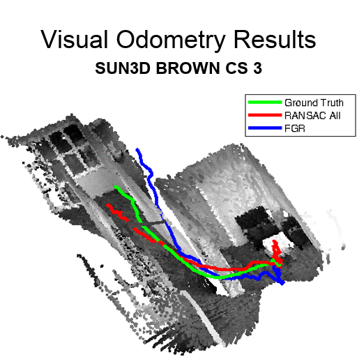

# Minimal Solvers for 3D Scan Alignment With Pairs of Intersecting Lines
Andre Mateus<sup>1</sup>, Srikumar Ramalingam<sup>2</sup>, and Pedro Miraldo<sup>1</sup>

<sup>1</sup>Instituto Superior Tecnico, Lisboa <sup>2</sup>Google Research, NY 
<br />
E-Mail: {andre.mateus,pedro.miraldo}@tecnico.ulisboa.pt

This project provides minimal solvers for 3D registration using intersecting lines.

If you want to use solvers.cpp/hpp file, please cite:
```
@InProceedings{Mateus_2020_CVPR,
author = {Mateus, Andre and Ramalingam, Srikumar and Miraldo, Pedro},
title = {Minimal Solvers for 3D Scan Alignment With Pairs of Intersecting Lines},
booktitle = {The IEEE/CVF Conference on Computer Vision and Pattern Recognition (CVPR)},
month = {June},
year = {2020}
}
```

For solverPoints.cpp/hpp file, please cite:
```
@InProceedings{Miraldo_2019_CVPR,
author = {Miraldo, Pedro and Saha, Surojit and Ramalingam, Srikumar},
title = {Minimal Solvers for Mini-Loop Closures in 3D Multi-Scan Alignment},
booktitle = {The IEEE Conference on Computer Vision and Pattern Recognition (CVPR)},
month = {June},
year = {2019}
}
```

For solverLines.cpp/hpp file, please cite:
```
@InProceedings{henrikstewenius2005solutions,
  title={Solutions to minimal generalized relative pose problems},
  author={HenrikStew{\'e}nius, MagnusOskarsson and Astr{\"o}m, Kalle and Nist{\'e}r, David},
  year={2005},
  booktitle={OMNIVIS}
}
```
